 

## About me

I'm a backend developer and Systems Engineering student at **Universidad Nacional de Costa Rica**. I build RESTful APIs and microservices with **Java and Spring Boot**, designing around **Hexagonal / Clean Architecture** and **SOLID** principles.

My workflow combines **Spec-Driven Development (SDD)**, **Test-Driven Development (TDD)** and **AI-assisted coding** with multiple agent roles, always keeping a human in the loop for the decisions that matter.

 

  

  

  

 

<a href="https://github.com/Exar-lab/AegisNotify"><b>AegisNotify</b></a> &nbsp;·&nbsp;
<a href="https://github.com/Exar-lab/Bank-project"><b>Bank-project</b></a>

  

 

## What I bring

- RESTful CRUD APIs with Spring Boot, JPA/Hibernate and MySQL
- Microservices with Eureka service discovery
- Role-based access control with Spring Security
- API and contract testing with Postman
- Clean Code and SOLID, with a spec-first and test-first mindset

## Education

- **B.Sc. in Systems Engineering** (in progress), Universidad Nacional de Costa Rica
- Spring Boot, Microservices Architecture and Spring Security: completed
- Software Testing: in progress
- AI-assisted development, SDD and TDD: self-taught

## Let's connect

I'm open to backend and Java/Spring Boot opportunities and collaborations.

  

